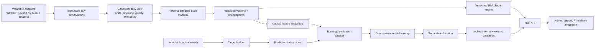

# Patient Zero — future steps после аудита `origin/main`

Статус: целевая архитектура и безопасный implementation plan.

Дата аудита: 2026-07-18.

Источник истины для аудита: `origin/main@0f296123527d74b0d1420d3fce4a8484e1ef9f0d`.

Этот документ задаёт новое направление Patient Zero: раннее выявление illness-related физиологических изменений по wearable-данным. Он не утверждает, что текущая модель уже умеет выдавать клинически или статистически подтверждённую персональную вероятность заболевания.

## 1. Границы аудита

Аудит выполнен по содержимому `origin/main`, без checkout другой ветки и без смешивания с незакоммиченными локальными изменениями.

На момент аудита:

- рабочая ветка указывает на тот же commit, что и `origin/main`;
- локальная ветка `main@eaeee82becefb6862c2c9895a3f296e8490bc69b` отстаёт от `origin/main` на 6 коммитов;
- рабочее дерево содержит незакоммиченные изменения;
- `FUTURE_STEPS.md`, `docs/` и `web/lib/risk-score.ts` не входят в audited `origin/main`.

Следствие: перед реализацией каждый локальный изменённый или untracked файл нужно инвентаризировать и либо сохранить отдельным checkpoint, либо осознанно перенести. Нельзя массово заменять рабочее дерево состоянием другой ветки.

## 2. Новое позиционирование

Patient Zero — не AI-доктор, не диагностическая система и не универсальная медицинская платформа.

Рабочее описание продукта:

> Patient Zero compares wearable signals with a personal baseline and is designed to flag unusual physiological changes that may precede symptoms.

Система должна отвечать на один вопрос:

> Показывают ли доступные wearable-сигналы необычное и устойчивое изменение относительно персональной нормы пользователя?

Система не должна:

- ставить диагноз;
- определять конкретное заболевание;
- заменять медицинскую помощь;
- выдавать treatment advice;
- называть anomaly score вероятностью заболевания без отдельного доказательства calibration и validation.

WHOOP — первый приоритетный wearable, но внутренние data contracts и ML pipeline должны оставаться device-agnostic.

## 3. Аудит текущего продукта

### 3.1. Что реально работает в `origin/main`

В репозитории есть:

- Next.js frontend;
- FastAPI/scikit-learn ML service;
- Stanford wearable dataset и preprocessing script;
- causal rolling personal baseline;
- robust z-score;
- CUSUM/changepoint detector;
- HistGradientBoosting classifier;
- isotonic calibration code;
- per-signal deviations и объяснения;
- retrospective Replay/Report screens;
- RU/EN localization;
- WHOOP helper-код.

Однако текущий пользовательский flow — в основном UI над одним retrospective Stanford `/demo` case:

- `/home`, `/forecast`, `/today`, `/next-steps`, `/labs` и `/replay` получают данные из `/demo`;
- `/report` показывает retrospective metrics из сохранённых model artifacts;
- кнопка `Connect WHOOP` на landing screen ведёт на `/home`;
- web OAuth callback, user session и end-to-end token flow в `origin/main` отсутствуют;
- наличие WHOOP helper-кода не подтверждает работающую live-интеграцию.

Поэтому текущий статус интеграции нельзя описывать как connected WHOOP.

### 3.2. Страницы и функции, которые нужно удалить

Удалить из целевого продукта:

- `/forecast` — текущая реализация показывает уже известные будущие строки retrospective demo как «завтра», `+2` и `+3` дня;
- `/next-steps` — symptom questionnaire и medical next-step flow;
- `/labs` — blood/lab analysis;
- `/api/labs-summary` — Claude-generated lab summary;
- emergency triage;
- полноценный symptom checker;
- AI doctor / generic medical chatbot;
- длинные AI medical summaries;
- diagnosis-oriented status и action copy;
- рекомендации о лекарствах, тестировании, изоляции или лечении;
- fake logout до появления реальной auth/session semantics.

Компоненты и библиотеки, обслуживающие только этот scope, также подлежат удалению после переноса действительно полезной wearable-логики.

### 3.3. Страницы, которые нужно перенести или пересобрать

- `/today` → `/signals`;
- `/replay` → `/timeline`;
- `/report` → `/research`;
- `/home` сохранить, но убрать demo-as-personal и probability claims;
- `/` оставить как onboarding/connection entry вне основной навигации, но показывать только реально доступный способ подключения или импорта.

Целевая основная навигация:

1. Home.
2. Signals.
3. Timeline.
4. Research.

### 3.4. Что можно оставить от symptom input

Допустим только минимальный optional logging:

- интервал или дата первого замеченного симптома;
- необязательное короткое описание;
- источник и степень уверенности label;
- явный consent на research use.

Эти данные нужны для Timeline, lead-time evaluation и будущего label collection. Они не должны запускать diagnosis или triage flow.

## 4. Что сохранить

### 4.1. ML-ядро

Сохранить и развивать:

- causal personal baseline;
- rolling median/MAD или другой robust scale estimator;
- robust z-score;
- CUSUM/changepoint detection;
- anomaly persistence;
- per-signal explanation;
- multi-signal fusion;
- anomaly-derived features для research classifier;
- Stanford ETL как development benchmark;
- synthetic data только для unit/integration tests;
- FastAPI boundary между ML и frontend.

Принцип причинности обязателен: score на день `t` может использовать только информацию, доступную не позже `t`.

### 4.2. Продуктовые элементы

Сохранить:

- тёмный визуальный язык dashboard;
- WHOOP visual;
- RU/EN;
- top changed signals;
- Replay как основу Timeline;
- Report как основу Research;
- ясный non-diagnostic disclaimer.

### 4.3. Device-agnostic подход

Сохранить идею canonical signal names и adapter boundary. При этом device transfer пока является архитектурной гипотезой, а не доказанным свойством модели.

Source и maturity интеграции — две независимые оси.

`source_mode`:

| Значение | Что означает |
|---|---|
| `research_demo` | публичный retrospective dataset |
| `personal_export` | импортированный export конкретного пользователя |
| `personal_live` | данные получены через live provider flow |
| `synthetic_test` | synthetic fixture, только для разработки и тестов |

`integration_status`:

| Значение | Что означает |
|---|---|
| `planned` | интеграция ещё не реализована |
| `implemented` | adapter существует и проходит локальные tests |
| `e2e_verified` | OAuth/session/token или export flow проверен end-to-end |

Stanford demo, CSV export и live wearable data нельзя показывать как один и тот же source mode. `implemented` нельзя выдавать за `e2e_verified`.

## 5. Как сейчас рассчитывается risk и почему это не подтверждённая probability

В `origin/main` существуют три разных risk-like слоя:

1. raw Health Deviation Index (`HDI`);
2. frontend mapping `HDI / 3.5` в шкалу 0–100;
3. classifier `infection_probability`.

Поверх них применяются несогласованные decision thresholds:

- UI bands по classifier output `0.3` и `0.6`, частично смешанные с HDI/alarm;
- classifier operating threshold `0.4454`;
- detector threshold `2.375`.

Они решают разные задачи и не образуют единую статистическую risk policy.

### 5.1. UI `riskPct`

Frontend преобразует HDI по формуле:

```text
riskPct = clamp(round(HDI / 3.5 × 100), 0, 100)
```

Число `3.5` является выбранным scale constant. В репозитории нет статистической модели, которая связывает этот процент с observed illness frequency.

Вывод: это визуально нормализованный anomaly score, а не вероятность заболевания.

### 5.2. `infection_probability`

Serving ML service возвращает `predict_proba()` HistGradientBoosting classifier, поверх которого применяется isotonic calibration.

Это тоже нельзя считать подтверждённой персональной probability, потому что:

- classifier target не совпадает с чистой prospective early-warning задачей;
- isotonic calibrator использует обычный `cv=3`, а не user-group-aware folds;
- calibration quality не проверена на locked group-disjoint test;
- опубликованные ROC-AUC, threshold, ROC artifact и `12/25` посчитаны на некалиброванных OOF predictions base classifiers, а сохранённая isotonic-calibrated serving model отдельно не оценивалась;
- нет независимой external validation;
- нет calibration slope/intercept, reliability confidence intervals и release criteria;
- модель и detector настраивались и описывались на одной Stanford development cohort.

Итоговый продукт до прохождения всех release gates должен показывать только `Risk Score 0–100`.

## 6. Текущие данные, модели, метрики и calibration

### 6.1. Данные

Подтверждённый pipeline использует committed derived daily Stanford RHR CSV:

- 8 804 daily rows до feature warmup;
- 118 subjects до feature warmup;
- 27 onset markers;
- после текущего feature/preprocessing pipeline: 6 812 usable rows;
- 116 usable subjects;
- 124 positive rows.

WHOOP live user cohort, independently labeled external cohort и prospective production cohort в репозитории не подтверждены.

### 6.2. Методы и модели

Используются:

- rolling personal median;
- MAD-based robust normalization;
- robust z-scores;
- CUSUM/changepoint rules;
- weighted multi-signal HDI;
- HistGradientBoosting classifier;
- GroupKFold OOF predictions для classifier evaluation;
- isotonic calibration через `CalibratedClassifierCV`;
- threshold selection по development results.

Код поддерживает weighted multi-signal HDI, но committed Stanford metrics получены только на resting heart rate. Текущий classifier artifact также использует только RHR-derived features. Multi-signal performance пока не подтверждена.

XGBoost может использоваться только при наличии соответствующей зависимости; фактическая сохранённая модель и текущие metrics относятся к HistGradientBoosting. Выбор model family не должен зависеть от случайного состава локального environment.

### 6.3. Зафиксированные baseline-результаты

В текущих artifacts записано:

- classifier ROC-AUC: `0.545`;
- classifier operating threshold: `0.4454`;
- classifier negative-label alarm rate: `0.0712` (поле artifact называется `healthy_false_alarm_rate`);
- classifier episode detection: `12/25` среди warmup/complete-case eligible episodes;
- classifier median lead: `3.5` дня;
- detector detection: `16/27` episodes в окне `[-7, +2]`;
- strictly presymptomatic detector detection: `8/27`;
- median presymptomatic lead: `5` дней среди этих 8 episodes;
- detector false-alarm days: `215`;
- scorable healthy days: `6 576`;
- отношение: примерно 1 alarm-day на `30.6` scorable healthy days.

Эти числа являются descriptive development baselines. Они:

- не имеют external validation;
- не имеют обязательных confidence intervals;
- не доказывают clinical utility;
- не подтверждают calibration;
- не должны объединяться в один маркетинговый процент.

`215 / 6 576` — частота alarm-days, а не частота отдельных alert episodes. Эти метрики нельзя называть взаимозаменяемо.

Classifier `0.0712` рассчитан на usable rows с `label == 0`; такие rows не гарантированно являются клинически здоровыми и могут включать ramp/recovery вне узкого target window.

Coverage bias также нужно показывать явно: два из 27 onset не входят в classifier episode evaluation после warmup/complete-case filtering. `12/25` нельзя представлять как unconditional `12/27`; coverage и misses среди всех eligible episodes должны сообщаться отдельно.

## 7. Проблемы текущей ML-архитектуры

### 7.1. Target и label mismatch

Сейчас используются разные окна:

- classifier day label: `[-3, +1]`;
- classifier episode evaluation: `[-7, +1]`;
- detector evaluation: `[-7, +2]`.

Часть positive window находится после symptom onset. Поэтому текущая задача ближе к classification of an illness-related state, чем к строгому prospective prediction.

Нужно выбрать один primary estimand и использовать его в training, calibration, threshold selection, test, external validation и UI.

### 7.2. Calibration leakage

GroupKFold для classifier OOF снижает риск переноса дней одного пользователя между model train и validation. Но `CalibratedClassifierCV(cv=3)` не получает user groups и не обеспечивает subject-disjoint calibration folds.

Исправление: отдельные calibration users или собственный group-aware calibration pipeline.

Дополнительно calibrated serving artifact и опубликованные OOF metrics относятся к разным estimator pipelines. Их нельзя трактовать как evaluation одной и той же финальной модели.

### 7.3. Label-construction uncertainty

Текущий Stanford builder:

- выбирает symptom date, ближайшую к diagnosis и предпочтительно до неё, а не гарантированно первый symptom onset;
- при отсутствии symptom date использует diagnosis date;
- ставит onset marker только при точном совпадении onset date с доступным daily RHR record;
- при отсутствии совпадения помечает onset как out-of-range в console output, но не формирует отдельный machine-readable exclusion record.

Следствие: onset source, uncertainty, fallback и exclusion должны сохраняться в label metadata и учитываться в sensitivity analyses.

### 7.4. Optimistic selection и отсутствие locked test

Detector threshold, spread, warmup и classifier operating threshold выбираются на той же development cohort, на которой затем описывается качество.

Исправление: development/nested validation для выбора, отдельный calibration split, locked internal test и independent external validation.

### 7.5. Calendar-gap errors

В данных обнаружены 181 calendar gap у 47 subjects, суммарно 720 пропущенных календарных дней. Текущие rolling windows, `diff()` и consecutive-day logic работают по строкам и могут ошибочно считать разорванные наблюдения соседними днями.

Исправление: явная daily index semantics, gap-aware lags/windows и coverage eligibility.

### 7.6. Некорректная missingness semantics

Проблемы:

- missing steps в Stanford builder заменяются нулём;
- denominator weighted fusion включает канал, если его колонка существует, даже когда конкретное дневное значение отсутствует;
- complete-case `dropna` меняет cohort без достаточно явного отчёта;
- отсутствие канала может быть спутано с нормальным значением.

Исправление: availability masks, coverage flags, quality thresholds и отсутствие silent zero imputation.

### 7.7. Baseline contamination и adaptation

Rolling baseline может постепенно поглощать illness/recovery shift и считать его новой нормой.

Исправление: baseline states и policy:

- `warming`;
- `ready`;
- `stale`;
- `frozen`;
- `recovery`.

Illness/alarm/recovery intervals не должны молча обновлять healthy baseline.

### 7.8. Episode evaluation errors

`changepoint.evaluate_detection` фактически предполагает один onset на пользователя. Это несовместимо с repeated episodes. Classifier `_episode_metrics` уже итерирует несколько onset и не должен ошибочно описываться как имеющий ту же проблему.

Также:

- `MIN_RUN=1` позволяет single-day alert;
- нет явной alert state machine и cooldown;
- false alarms считаются как days, а не как независимые alert episodes.

Исправление: `episode_id`, repeated-event handling, sustained alert rule, cooldown и отдельные day-level/episode-level metrics.

### 7.9. Weak external validity

Stanford development results не доказывают перенос на:

- WHOOP sensors;
- другие устройства;
- другие illness types;
- другие популяции;
- prospective user data;
- lifestyle hard negatives.

Независимая external validation обязательна перед percentage release.

### 7.10. Reproducibility risks

Проблемы:

- environment-dependent fallback между model families;
- недостаточно pinned dependencies;
- stale experiment documentation;
- нет artifact manifest с data/code/config hashes;
- нет полноценного набора tests для labels, splits, gaps, calibration и metrics.

## 8. Целевая ML-задача и label contract

Предпочтительный primary estimand для early prediction:

> Для пользователя, который на момент `t` не находится в известном symptomatic/recovery state и имеет достаточный follow-up, предсказать, начнётся ли следующий eligible episode onset в интервале `(t, t + H]`.

`H` нельзя выбирать по удобству интерфейса. Его нужно заморозить после data audit с учётом:

- timestamp resolution;
- onset uncertainty;
- available follow-up;
- числа users и episodes;
- class balance;
- clinical/product usefulness;
- published protocol assumptions.

Для каждого observation day нужны:

- `target_definition_id`;
- `prediction_horizon`;
- `at_risk_eligible`;
- `label`;
- `label_source`;
- `onset_start` и `onset_end` при неопределённости;
- `censoring_reason`;
- `episode_id`;
- illness type/confirmation status, если известны;
- exclusion reason.

Дни с неизвестным будущим наблюдением нельзя автоматически считать healthy negatives.

Confirmed illness, diagnosis-date fallback и generic self-reported symptoms нельзя автоматически объединять в один calibrated target. Case definition должна задавать совместимость label sources, primary analysis strata и sensitivity analyses.

Текущий state target `[-3, +1]` можно оставить как отдельный research comparator, но нельзя называть prospective illness probability.

## 9. Каноническая data architecture

### 9.1. Immutable raw observations

Минимальные поля:

```text
user_id
provider
device_id
device_model
dataset_id
source_record_id
event_timestamp
available_at
finalized_at
record_revision
local_date
timezone
signal_name
value
unit
ingested_at
provenance
quality_flag
```

Raw layer не должен перезаписываться normalization или imputation.

`event_timestamp` не равен времени доступности записи. Training snapshot должен воспроизводить только ту revision, которая реально была доступна к scoring cutoff; для этого нужны as-of join и cutoff tests.

### 9.2. Canonical daily view

Daily layer содержит:

```text
user_id
local_date
canonical_signal
daily_value
aggregation_method
aggregation_version
availability
coverage
quality
gap_from_previous_day
source_mode
```

Не все devices обязаны предоставлять одинаковые сигналы. Недоступный канал — это missing capability, а не ноль.

### 9.3. Episode truth и prediction-index labels

Immutable episode truth хранится отдельно от wearable observations:

```text
episode_id
user_id
illness_type
confirmation_status
onset_start
onset_end
onset_source
onset_uncertainty
recovery_end
consent_scope
```

Derived prediction-index labels строятся отдельно для конкретного estimand:

```text
user_id
index_time
target_definition_id
prediction_horizon
eligible
label
censoring_reason
episode_id
label_source_stratum
```

Один episode может использоваться в нескольких исследовательских estimands, поэтому `target_definition_id` не является свойством episode truth.

Физическое разделение только снижает риск leakage. Нужны causal/as-of joins, запрет label-derived features в scoring pipeline и автоматические leakage tests.

### 9.4. Dataset inventory

Кандидаты для проверки:

- Stanford COVID-19 Wearables;
- Alavi et al.;
- Oura TemPredict;
- Warrior Watch;
- consented WHOOP exports.

Это список кандидатов, а не утверждение об их текущей доступности или совместимости.

Для каждого источника нужно зафиксировать:

- license/access;
- provenance;
- device и signals;
- users/episodes;
- onset definition и uncertainty;
- timestamp/timezone quality;
- missingness/gaps;
- demographics и selection bias, если доступны;
- возможность internal или external use;
- запрещённые claims.

## 10. Целевая системная архитектура



Архитектурные правила:

1. Adapters отвечают только за source-specific ingestion и mapping.
2. Canonical layer хранит units, timezone, provenance, coverage и missingness.
3. Personal baseline и detector остаются production core.
4. Supervised classifier сначала остаётся research/evaluation layer.
5. Labels не участвуют в online score computation.
6. Score и probability — разные output modes с разными release gates.
7. Research demo никогда не подменяет personal source.

## 11. Единый risk contract

### 11.1. Score mode — обязательный текущий режим

Пример contract shape:

```json
{
  "as_of": "ISO-8601 timestamp",
  "source_mode": "personal_export",
  "integration_status": "e2e_verified",
  "provider": "whoop",
  "adapter_version": "<version>",
  "dataset_version": null,
  "demo_case_id": null,
  "risk_mode": "score",
  "risk_score": 68,
  "risk_band": "elevated",
  "band_version": "<version>",
  "decision_status": "available",
  "reason_codes": [],
  "calibrated_probability": null,
  "probability_available": false,
  "probability_supported_for": [],
  "score_definition_id": "<version>",
  "score_version": "<version>",
  "target_definition_id": null,
  "prediction_horizon_days": null,
  "baseline_status": "ready",
  "data_quality": {
    "status": "sufficient",
    "available_signals": [],
    "missing_signals": []
  },
  "model_version": "<version-or-null>",
  "calibration_version": null,
  "explanations": []
}
```

Значение `68` здесь только иллюстрирует тип поля, а не заявляет результат модели.

Для `research_demo` дополнительно обязательны `dataset_version` и `demo_case_id`. Для personal sources обязательны provider/adapter provenance.

Допустимые decision states нужно зафиксировать в schema, например: `available`, `warming`, `insufficient_data`, `stale`, `unsupported` и `error`. Число и band присутствуют только для `available`.

`risk_score` должен быть:

- монотонным относительно versioned anomaly/fusion severity;
- полностью воспроизводимым;
- вычисляемым только versioned backend engine; UI только отображает полученный результат;
- описанным в Research;
- без символа `%`;
- без интерпретации как observed illness frequency.

`risk_band` и его границы также вычисляет backend. `band_version` должен ссылаться на заранее описанную band policy; frontend не задаёт собственные пороги.

Нужно удалить произвольную формулу `HDI / 3.5` или явно заменить её документированной, версионированной и протестированной score transformation.

Для Stanford case:

```text
source_mode = research_demo
```

Для реального export:

```text
source_mode = personal_export
```

Для проверенной live-интеграции:

```text
source_mode = personal_live
```

При warming, insufficient coverage, stale data или неподдерживаемом device/capability profile API должен возвращать `risk_score = null`, `risk_band = null`, соответствующий `decision_status` и machine-readable `reason_codes`.

### 11.2. Calibrated probability mode — будущий режим

Поле `calibrated_probability` можно включить только если:

- primary target и prediction horizon заморожены;
- model, features и score version заморожены;
- train, calibration и locked test разделены по users;
- calibrator обучен на group-disjoint calibration users;
- discrimination и calibration проверены на locked internal test;
- independent external cohort/device проверены без tuning;
- release domain заранее указан в `probability_supported_for`;
- uncertainty и ограничения опубликованы;
- release decision документирован.

Даже успешная internal calibration сама по себе не разрешает percentage UI.

`probability_supported_for` должен ограничивать provider/device/channel profile/population, для которых external evidence действительно получено. Успех на Fitbit/Oura не разрешает WHOOP percentage без WHOOP-compatible evidence или заранее определённой device-bridging validation.

Только после прохождения gates UI может показывать:

```text
Early Illness Risk
XX%
```

Подпись должна точно соответствовать target и horizon. Это не вероятность конкретного диагноза.

## 12. Baseline, features и detector

### 12.1. Baseline policy

Baseline должен:

- строить center/spread для дня `t` только по данным с availability time `< t`; measurement дня `t` используется как оцениваемое наблюдение, а не как часть его baseline;
- требовать минимальное chronological coverage, а не только число строк;
- учитывать gaps и timezone;
- иметь `baseline_version`, age и effective window;
- возвращать raw center/spread для Signals;
- в online режиме замораживаться только по информации, доступной к `t`;
- использовать retrospective truth-based exclusion только в research evaluation, не в production scoring;
- иметь escape/rebaseline policy после устойчивого lifestyle/device shift;
- становиться `stale`, если данных недостаточно;
- не выдавать уверенный score в `warming` state.

### 12.2. Features

Минимальные individual features:

- raw value и personal baseline;
- robust deviation/z-score;
- 3/5/7-day causal trend;
- change from previous real calendar day;
- recent maximum deviation;
- consecutive abnormal calendar days;
- changepoint strength;
- baseline age/state;
- signal availability/coverage/quality.

Cross-signal candidates:

- RHR increase + HRV decrease;
- respiratory-rate increase;
- skin-temperature increase;
- sleep disruption;
- activity/recovery reduction;
- number and agreement of abnormal signals;
- one-extreme-signal;
- two-moderate-signals;
- broad-mild-shift.

Context features допустимы только при известном timestamp и provenance.

### 12.3. Fusion и alert semantics

Fusion denominator должен учитывать только доступные и eligible signals.

Availability-aware fusion сама по себе не делает scores сопоставимыми между devices и разными channel sets. Нужны minimum capability profiles и отдельная validation/normalization policy для каждого supported device/channel profile.

Нужно сравнить:

- max/top-k;
- one-extreme OR two-moderate rule;
- weighted mean с availability mask;
- regularized logistic fusion;
- HistGradientBoosting fusion.

Нужны:

- minimum coverage rule;
- sustained-change requirement;
- alert state machine;
- cooldown;
- отдельный alert start/end;
- no-data/insufficient-data state.

Нельзя настраивать fusion на одном личном episode.

## 13. Train, evaluation и calibration protocol

### 13.1. Immutable split registry

Каждый experiment должен ссылаться на:

- dataset manifest version;
- code commit;
- config hash;
- target definition;
- feature version;
- immutable user split assignment;
- random seed;
- artifact hashes.

### 13.2. Рекомендуемый protocol

```text
Development users
    └─ nested group-aware train/validation
       └─ feature and model selection

Calibration users
    └─ group-aware inner split/cross-fitting
       └─ calibrator-method and post-calibration threshold selection
          └─ refit the frozen method on all calibration users

Locked internal test users
    └─ one-time evaluation of the already frozen artifact and policy

Independent external cohort/device
    └─ no tuning; final transfer and release evidence
```

Правила:

- все дни пользователя остаются в одной outer group;
- все episodes пользователя остаются с этим пользователем;
- threshold нельзя выбирать на locked test;
- calibrator нельзя обучать на locked test;
- external cohort нельзя использовать для feature/model/threshold tuning;
- calibrator method и post-calibration operating threshold выбираются до открытия locked test;
- выбор calibrator method внутри calibration cohort использует group-aware inner validation/cross-fitting; если events для этого недостаточно, primary method задаётся protocol заранее, а alternatives остаются sensitivity analyses;
- model/calibrator/threshold artifact замораживается до locked test;
- если после test model переобучается на calibration/test users, прежние validation claims больше не относятся к новому artifact;
- repeated episodes моделируются явно;
- test lock и unlock reason журналируются.

До создания split нужен feasibility gate: заранее определить минимально необходимое число independent users/events в development, calibration и locked test для требуемой uncertainty. Конкретные числа устанавливаются protocol до анализа, а не выдумываются в roadmap. Если данных недостаточно, group separation не ослабляется — проект остаётся score-only.

GroupKFold, StratifiedGroupKFold или GroupShuffleSplit можно использовать в соответствии с episode distribution. Leave-one-subject-out — sensitivity analysis, а не автоматическая замена основного protocol.

### 13.3. Model baselines

Сравнить на одном target и split:

1. Changepoint-only detector.
2. Regularized logistic regression.
3. HistGradientBoosting.
4. XGBoost/LightGBM только если объём данных и pinned environment это оправдывают.

Random forest и deep sequence models не являются обязательным первым шагом.

При текущем объёме событий простые модели и Platt scaling должны быть primary baselines; isotonic остаётся comparator и требует особенно осторожной оценки overfit.

### 13.4. Calibration

На development/calibration data, до открытия locked test, сравнить с group-aware inner validation:

- uncalibrated output;
- Platt scaling;
- isotonic regression;
- temperature scaling только если применимо к model output.

Обязательные calibration metrics:

- Brier score;
- log loss;
- calibration curve;
- calibration slope;
- calibration intercept;
- expected calibration error с раскрытым binning;
- observed vs predicted rate by risk bin;
- user-cluster bootstrap confidence intervals.

Calibration report должен учитывать target prevalence и размер каждого bin.

Calibration на обогащённой retrospective COVID cohort не переносится автоматически на deployment prevalence. Protocol должен заранее описать sampling weights или отдельную recalibration policy. External cohort нельзя одновременно использовать для recalibration и независимой final evaluation.

### 13.5. Early-warning и operational metrics

Обязательные:

- ROC-AUC и PR-AUC;
- sensitivity, specificity, precision и F1 при заранее определённом operating point;
- episode detection before onset;
- warning lead-time distribution;
- false alert episodes per user-month;
- alarm-days per healthy days;
- users with at least one false alert;
- alert duration;
- data coverage и abstention rate;
- PPV/NPV при явно указанной target prevalence;
- user/episode-clustered confidence intervals.

До открытия locked и external cohorts нужно preregister:

- one-to-one alert-to-episode matching;
- detection window и cooldown;
- handling одной тревоги рядом с несколькими episodes;
- lead-time summary среди detected episodes и sensitivity summary среди всех eligible episodes;
- acceptance criteria для calibration, alert burden, coverage, CI width и device/subgroup performance.

Значения acceptance criteria определяются после feasibility/data audit и до просмотра test results.

Reporting должен различать:

- day-level и episode-level metrics;
- alarm-days и alert episodes;
- internal и external results;
- retrospective и prospective evidence;
- synthetic tests и real-cohort metrics.

Confidence intervals обязательны для release evidence, а не «по возможности».

## 14. Целевой интерфейс

### Home

Показывает:

- `Early Illness Risk Score: X / 100` до percentage gate, только когда `decision_status = available`;
- Low / Moderate / Elevated как versioned score bands;
- изменение относительно предыдущего eligible day;
- `source_mode`;
- baseline status;
- data freshness и quality;
- короткое non-diagnostic explanation.

Не показывать confidence, если у него нет формального определения и validation.

При warming, insufficient coverage, stale/expired connection или unsupported capability Home показывает состояние и причину вместо числа. Disconnected, syncing, warming, insufficient, stale, connection error и research demo должны быть отдельными UI states.

### Signals

Для каждого доступного сигнала:

- current value и unit;
- personal baseline center/spread;
- deviation и trend;
- coverage/quality;
- contribution, совпадающий с реальной score formula;
- timestamp;
- причина отсутствия, если signal unavailable.

### Timeline

Показывает только известную историю:

- score по дням;
- signal deviations;
- first change;
- alert interval;
- optional symptom onset;
- recovery/baseline return;
- day-specific explanation.

Retrospective research case должен быть визуально помечен и не может выдавать будущие известные строки за forecast.

### Research

Показывает:

- research question;
- target definition и horizon;
- datasets/provenance/licenses;
- cohort flow после preprocessing;
- baseline/detector/model versions;
- split protocol;
- internal discrimination/calibration/alert metrics;
- external validation status;
- confidence intervals;
- limitations;
- reproducibility commands и artifact hashes.

### Общие UI-правила

- `source_mode` постоянно виден на всех четырёх страницах;
- research demo не использует персональные местоимения и actionable advice;
- Low/Moderate/Elevated имеют текстовые и icon/shape cues, а не различаются только цветом;
- графики имеют текстовую alternative/summary;
- keyboard navigation и visible focus входят в acceptance tests;
- отсутствующие calibration/external metrics показываются как `not measured`, а не как ноль;
- score bands приходят из backend вместе с `band_version`.

## 15. Пошаговый implementation plan

Каждая фаза должна быть небольшим reviewable change. Следующая фаза не должна скрывать незавершённые риски предыдущей.

### Phase 0 — Baseline freeze и сохранение локальной работы

Задачи:

- зафиксировать `origin/main@0f296123...` как audited base;
- инвентаризировать dirty/untracked files;
- создать безопасный checkpoint текущей работы;
- сохранить исходные artifacts, API samples и screenshots;
- добавить reproducibility note для baseline metrics.

Готово, когда:

- ни один пользовательский файл не потерян;
- код не изменил поведение;
- известен exact source каждого baseline result.

### Phase 1 — P0 safety containment

Это первая продуктовая операция после baseline freeze.

Задачи:

- убрать Labs, Next Steps и Forecast из navigation;
- отключить `/api/labs-summary`;
- поставить neutral redirect/404 на `/labs`, `/next-steps` и `/forecast`;
- пометить оставшийся Stanford flow как `research_demo`;
- убрать personal pronouns и actionable medical advice из demo;
- сохранить legacy code только настолько, насколько нужно для безопасной последующей миграции.

Готово, когда:

- retrospective demo-risk больше не запускает personal medical flow;
- clinical/AI endpoints недоступны пользователю;
- никакие полезные wearable components ещё не потеряны.

### Phase 2 — Truthful backend-owned risk semantics

Задачи:

- ввести единый `risk_mode`;
- сделать score mode единственным разрешённым UI mode;
- убрать `%`, `probability` и `infection_probability` из product copy;
- вычислять score и bands только в ML service;
- добавить `source_mode`, `integration_status`, provenance, `as_of`, versions, baseline status и data quality;
- добавить nullable score, decision states и reason codes;
- удалить frontend-only `riskPct(HDI)` interpretation;
- явно маркировать Stanford flow как `research_demo`.

Готово, когда:

- ни один экран не называет score вероятностью;
- demo не выглядит как personal connected data;
- API и UI используют один contract;
- frontend не содержит независимой score/band формулы.

До завершения Phase 6 этот score разрешён только как явно маркированный legacy experimental `research_demo`; personal score-only release ещё не разрешён.

### Phase 3 — Product migration и окончательный cleanup

Задачи:

- удалить Labs, Next Steps, triage, AI summary и Anthropic dependency;
- удалить Forecast;
- перенести Today → Signals;
- перенести Replay → Timeline;
- перенести Report → Research;
- удалить ActionCard medical advice;
- оставить четыре основных nav item.

Готово, когда:

- Home, Signals, Timeline, Research работают;
- нет blood analysis, AI doctor, diagnosis или emergency triage;
- полезная wearable logic перенесена до удаления legacy routes;
- build/typecheck/tests проходят.

### Phase 4 — Target и data contract

Задачи:

- утвердить primary estimand и `H`;
- создать `docs/TARGET_DEFINITION.md`;
- разделить raw, canonical daily, episode truth и prediction-index label schemas;
- создать dataset manifest;
- описать censoring, eligibility и onset uncertainty;
- проверить cohort counts после каждого preprocessing шага;
- выполнить feasibility/no-go assessment для числа independent users/events на development, calibration и test;
- считать Stanford exposed development cohort, а не постфактум создавать из него pristine locked test.

Готово, когда:

- любая training row трассируется до source record;
- target одинаков во всех pipeline stages;
- unknown follow-up не превращается в negative label;
- если статистической мощности недостаточно, зафиксирован score-only no-go для probability вместо ослабления split.

### Phase 5 — Adapters, source modes и privacy/security

Задачи:

- выделить общий adapter interface;
- перенести Stanford loader в research adapter;
- реализовать CSV/export adapter;
- проверить WHOOP export path;
- сгенерировать frontend types из Pydantic/OpenAPI contract;
- для live OAuth внедрить state/PKCE, где применимо, encrypted token storage, refresh rotation/revocation и least-privilege scopes;
- определить consent, retention, export/delete/revoke policy;
- закрыть API auth/CORS, добавить request limits и audit events;
- запретить logging raw wearable payloads, tokens и sensitive health fields.

Готово, когда:

- personal live, personal export, research demo и synthetic test не смешиваются;
- adapter tests проверяют units, timezone, duplicates и provenance;
- UI не заявляет неподтверждённую live integration;
- статус `e2e_verified` невозможен без privacy/security gate.

### Phase 6 — Baseline, gaps и missingness correctness

Задачи:

- реализовать gap-aware daily index;
- убрать silent zero imputation;
- добавить availability-aware fusion;
- реализовать baseline state machine;
- исправить repeated episodes;
- добавить sustained alert/cooldown;
- покрыть edge cases tests.

Готово, когда:

- no-data не равен normal;
- gaps не считаются consecutive days;
- illness/recovery не поглощаются baseline без policy;
- alert-days и alert episodes считаются отдельно;
- personal score остаётся internal/preview до Phase 8 и разрешён только для проверенного device/capability profile.

### Phase 7 — Evaluation harness

Задачи:

- создать immutable split registry;
- реализовать nested group-aware development;
- выделить calibration users;
- создать genuinely unexposed locked internal test, если feasibility и data provenance это позволяют;
- добавить complete metric/report pipeline;
- добавить cluster bootstrap intervals;
- preregister alert matching и quantitative acceptance criteria до открытия test/external data;
- замораживать exact model/calibrator/threshold policy перед locked evaluation.

Готово, когда:

- leakage tests проходят;
- threshold/calibration не используют test;
- каждый metric содержит target, split, cohort и version metadata.

### Phase 8 — Detector и classifier baselines

Задачи:

- воспроизвести current detector baseline;
- сравнить changepoint-only, logistic и HistGradientBoosting;
- оценить availability-aware fusion;
- выбрать модель по locked protocol, а не по local package availability;
- документировать failure modes.

Готово, когда:

- сравнение использует один target/split;
- detector остаётся понятным product core;
- classifier добавляется только при доказанном improvement;
- frozen score policy оценена на group-disjoint data с coverage/alert burden metrics;
- personal score-only release возможен только после прохождения заранее определённых score-mode acceptance criteria.

### Phase 9 — Internal calibration

Задачи:

- fit calibrators только на calibration users;
- выбрать Platt/isotonic и post-calibration threshold только на development/calibration data;
- заморозить calibrator и policy до открытия locked internal test;
- один раз оценить frozen artifact на locked internal test;
- записать calibration artifact/version;
- сохранить UI в score mode.

Готово, когда:

- calibration report воспроизводим;
- есть slope/intercept, Brier, log loss, reliability curve и uncertainty;
- внутренний результат не выдаётся за external evidence.

### Phase 10 — Independent external validation

Задачи:

- выбрать независимую cohort, соответствующую intended provider/device/channel profile и population;
- заморозить model, target, threshold и calibrator до запуска;
- оценить transfer, hard negatives, missing capabilities и user-month false alerts;
- опубликовать failures и limitations отдельно от internal results;
- не использовать одну external cohort одновременно для recalibration и independent final evaluation;

Готово, когда:

- external dataset не участвовал в tuning;
- известна target compatibility;
- результаты имеют confidence intervals;
- release review явно принимает или отклоняет percentage mode;
- `probability_supported_for` ограничен действительно проверенным deployment domain.

### Phase 11 — Percentage release

Разрешён только после успешной Phase 10 и прохождения заранее зарегистрированных acceptance criteria.

Задачи:

- включить `calibrated_probability`;
- обновить Home copy под точный target/horizon;
- показать calibration/external evidence в Research;
- добавить monitoring for drift, calibration decay и device changes;
- предусмотреть автоматический fallback в score-only/abstain mode;
- не включать percentage для неподдерживаемых providers/devices/channel profiles.

## 16. Карта файлов

Карта относится к audited `origin/main`. Перед изменением любого локально модифицированного файла нужно сравнить его с checkpoint.

### 16.1. Удалить после безопасного переноса wearable-логики

- `web/app/(app)/forecast/page.tsx`;
- `web/app/(app)/next-steps/page.tsx`;
- `web/app/(app)/labs/page.tsx`;
- `web/app/api/labs-summary/route.ts`;
- `web/components/NextSteps.tsx`;
- `web/components/LabsSummary.tsx`;
- `web/components/ActionCard.tsx`;
- `web/components/RiskDay.tsx`, если после миграции он обслуживает только fake forecast;
- `web/lib/forecast.ts`;
- `web/lib/labs.ts`;
- `web/lib/triage.ts`;
- `web/lib/symptoms.ts`, кроме минимальной onset logging logic, если она будет вынесена отдельно;
- `@anthropic-ai/sdk` и связанные environment variables из `web/package.json`/lockfile.

### 16.2. Перенести или заменить

- `web/app/(app)/today/page.tsx` → `web/app/(app)/signals/page.tsx`;
- `web/app/(app)/replay/page.tsx` → `web/app/(app)/timeline/page.tsx`;
- `web/app/(app)/report/page.tsx` → `web/app/(app)/research/page.tsx`;
- timeline data contract/`WeekPoint` перенести из удаляемого `web/lib/forecast.ts` в нейтральный timeline module.

Legacy routes можно временно redirect, но они не должны оставаться в основной навигации.

### 16.3. Изменить

Frontend:

- `web/app/page.tsx`;
- `web/app/layout.tsx`;
- `web/app/(app)/layout.tsx`;
- `web/app/(app)/home/page.tsx`;
- `web/components/Sidebar.tsx`;
- `web/components/Gauge.tsx`;
- `web/components/WhyBars.tsx`;
- `web/components/WeekTrend.tsx`;
- `web/components/RocChart.tsx`;
- `web/lib/api.ts`;
- `web/lib/status.ts`;
- `web/lib/signals.ts`;
- `web/lib/i18n.ts`;
- untracked `web/lib/risk-score.ts` — убрать независимые score/band thresholds либо свести к display-only helpers;
- `web/.env.example`;
- root `.env.example`;
- `web/next.config.mjs` и deployment/API proxy config;
- `web/package.json` и lockfile;
- environment documentation.

ML:

- `ml-service/src/app.py`;
- `ml-service/src/features.py`;
- `ml-service/src/changepoint.py`;
- `ml-service/src/score.py`;
- `ml-service/src/train.py`;
- `ml-service/src/whoop_client.py` — мигрировать в adapter и затем удалить либо оставить только временный compatibility shim;
- `ml-service/src/dataset.py` — мигрировать в adapters/schema и затем удалить либо оставить только временный compatibility shim;
- `ml-service/src/synth.py`;
- `ml-service/data/build_stanford.py`;
- `ml-service/data/README.md`;
- `ml-service/experiments/run_experiments.py`;
- `ml-service/experiments/README.md`;
- dependency files;
- root `README.md` и `HANDOFF.md`.

### 16.4. Создать

Frontend:

- `web/app/(app)/signals/page.tsx`;
- `web/app/(app)/timeline/page.tsx`;
- `web/app/(app)/research/page.tsx`;
- generated API types/client из Pydantic/OpenAPI;
- frontend display helpers без score/band thresholds;
- frontend tests для nav, source modes, warming/abstain states и legacy redirects;
- отдельный minimal onset logging module, только если он входит в ближайший scope.

ML/data:

- `ml-service/src/schema.py`;
- `ml-service/src/labels.py`;
- `ml-service/src/splits.py`;
- `ml-service/src/evaluate.py`;
- `ml-service/src/calibration.py`;
- `ml-service/src/risk_contract.py`;
- `ml-service/src/adapters/base.py`;
- `ml-service/src/adapters/stanford.py`;
- `ml-service/src/adapters/whoop.py`;
- `ml-service/src/adapters/csv_export.py`;
- `ml-service/data/manifest.yaml`;
- `ml-service/tests/` для labels, gaps, baseline, missingness, splits, metrics, calibration и API contract.

Documentation:

- `docs/TARGET_DEFINITION.md`;
- `docs/DATA_CARD.md`;
- `docs/MODEL_CARD.md`;
- `docs/SECURITY_PRIVACY.md`;
- `docs/SOURCE_MODES.md`;
- `docs/CLAIMS_EVIDENCE.md`;
- `docs/validation/`;
- artifact/split manifest documentation.

Некоторые из этих paths уже могут существовать как untracked локальная работа. Их нужно review и сохранить, а не создавать поверх вслепую.

### 16.5. Regenerate, не редактировать вручную

- `ml-service/models/model.joblib`;
- `ml-service/models/metrics.json`;
- `ml-service/models/roc.json`.

Generated artifacts должны включать data/code/config/target/split/model/calibration metadata.

## 17. Definition of Done ближайшего score-only релиза

Ближайший релиз готов, когда:

- основная навигация содержит только Home, Signals, Timeline и Research;
- Stanford case явно помечен `research_demo`;
- personal source не показывается без реального user data flow;
- UI показывает `Risk Score 0–100`, а не `%`;
- score и bands versioned и вычисляются только backend;
- API возвращает `source_mode`, `integration_status`, provenance, `as_of`, versions, decision status, baseline status и data quality;
- warming/insufficient/stale/unsupported states abstain и не показывают число;
- personal baseline, changepoint detector и explanations сохранены;
- missing data не подменяется normal/zero;
- fake forecast удалён;
- Labs, AI doctor, triage и diagnosis-oriented flow удалены;
- Research показывает только воспроизводимые metrics и их ограничения;
- нет claims о calibration, external validation или WHOOP connection без evidence;
- privacy/security gate выполнен для любого `personal_*` source;
- score-only personal release ограничен проверенными device/capability profiles;
- unit/integration tests, typecheck и build проходят;
- dirty/untracked пользовательские файлы не потеряны.

## 18. Оценка предыдущей версии архитектуры

Основное направление предыдущего `FUTURE_STEPS.md` было правильным:

- wearable-first positioning;
- personal baseline;
- changepoint detector;
- device-agnostic schema;
- Home / Signals / Timeline / Research;
- score-only режим до calibration;
- group-aware split;
- external validation до настоящего процента.

Но документ требовал важных исправлений:

1. `origin/main` уже содержал Labs и Next Steps; это не условный будущий scope.
2. Нужно было явно зафиксировать demo-as-personal и fake retrospective forecast как P0-проблемы.
3. Одной «calibration и independent validation» недостаточно без group-disjoint calibrator, locked internal test и обязательной external validation.
4. Target `[-3, +1]` смешивает pre- и post-onset state; для prediction нужен prospective estimand и censoring.
5. Data model нужно разделить на immutable raw, canonical daily view, episode truth и prediction-index labels.
6. Нужны gap-aware time semantics, baseline states и availability-aware fusion.
7. Alarm-days нельзя смешивать с alert episodes.
8. External validation должна быть обязательной, а не «по возможности».
9. Risk contract должен включать source, time, data quality и version metadata.
10. Phase order должен сначала исправлять truthfulness и data correctness, а уже затем улучшать model complexity.

## 19. Итоговый порядок решений

1. Сохранить локальную работу и audited baseline.
2. Немедленно отключить clinical/demo-as-personal flows.
3. Завершить backend-owned score-only contract и source-mode separation.
4. Перенести продукт на Home / Signals / Timeline / Research и удалить legacy scope.
5. Заморозить target и canonical data contracts.
6. Добавить adapters, provenance и privacy/security gates.
7. Исправить gaps, missingness, baseline и episode semantics.
8. Построить leakage-resistant evaluation harness.
9. Сравнить простые detector/classifier baselines.
10. Выполнить отдельную internal calibration.
11. Провести independent external validation в intended deployment domain.
12. Только после успешного preregistered release review включить процент для поддержанных domains.

Главный принцип:

> Красивый процент остаётся возможной конечной формой интерфейса, но до формального target, group-aware calibration, locked evaluation и независимой external validation Patient Zero показывает только честный Risk Score.
